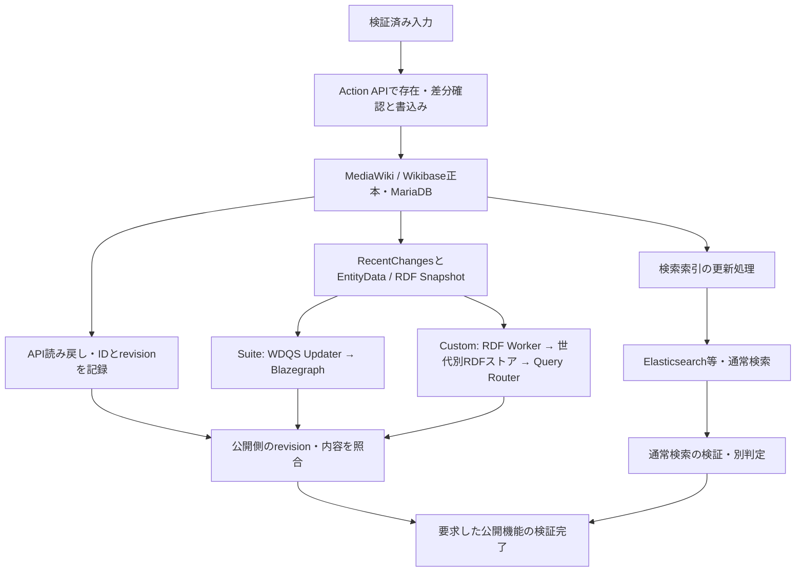

# 登録・索引同期・公開の完全性レビュー

調査日：2026-09-10。結論：現実装は正本への登録確認には対応するが、Suite / Custom Wikibaseの検索・SPARQL反映までの完全性は保証していない。前回の「存在・差分確認」方針を維持し、別工程として公開側の検証を追加する必要がある。本書の公開検証フローは仕様案であり、同期待機・SPARQL検証を実装済みとはしない。

## 1. 登録先と反映先

Suite公式構成の正本DBはMariaDB。ElasticsearchとBlazegraphは用途の異なる検索用ストアで、直列にElasticsearchを経由してBlazegraphへ送る構造ではない。[Suite公式構成](https://wikiba.se/wikibase-suite/installation-quickstart/)、[公式WDQSイメージ](https://hub.docker.com/r/wikibase/wdqs)。



SuiteのWDQS updaterはWikibaseの変更を取得する独立した処理。変更履歴の保持期間を越えたデータは、updaterの待機だけでは回収できず、RDF dumpからの再構築が必要になり得る。採用imageのバージョンごとに初期cursorの挙動を確認する。[公式WDQSの初期化・再構築仕様](https://hub.docker.com/r/wikibase/wdqs)。

CirrusSearch側にも更新ジョブやElasticsearchのrefreshによる待ち時間がある。SPARQLで成功しても通常検索の反映を証明しない。検索結果の存在だけで全属性・revisionの索引一致を証明することもできない。[CirrusSearch公式設定](https://github.com/wikimedia/mediawiki-extensions-CirrusSearch/blob/master/docs/settings.txt)。

Custom Wikibaseも正本はMediaWiki/WikibaseとMariaDB。PostgreSQLはRDF同期cursor、entity revisionの管理、公開世代の切替等に使う。core-onlyではPostgreSQLもRDFバックエンドも必須ではない。[ADR-0035](https://github.com/hirokiu/custom-wikibase/blob/4cb9044dc995ed75c521280dbd786390bd8255c4/docs/adr/0035-japan-wikibase-product-boundary.md)、[ADR-0036](https://github.com/hirokiu/custom-wikibase/blob/4cb9044dc995ed75c521280dbd786390bd8255c4/docs/adr/0036-japan-wikibase-postgresql-boundary.md)。

## 2. 旧WikibaseSyncのコードから確認できたこと

調査対象はローカルの `med_WikibaseSync` と、旧SIPディレクトリの `Wikibase/WikibaseSync`。同名ツールの全バージョンや当時の運用全体を断定しない。

|ファイル・箇所|確認結果|
|---|---|
|`utilities/mapper.py:13`|SPARQLからWikidata ID → ローカルIDの対応表を一括取得|
|`utilities/mapper.py:31`|作成したIDをプロセス内の辞書に追加|
|`utilities/util.py:265`|作成後の対応をその辞書に保存|
|`utilities/util.py:1414` のchange_item|既存判定後にPywikibotでItemを取得して変更処理|
|`wikihospital.py:70` / `:85`|医療機関コード、郵便番号・名称をSPARQL検索|
|`utilities/sparql_queries.py:40`|whileはLIMIT/OFFSETページング|
|同`:72`|sleepはHTTP 429への待機|

READMEも、WikidataのItem/Propertyを別Wikibaseへ同期する目的を記載している。

確認した箇所には「書き込んだrevisionがSPARQLに現れるまで待つ」バリアは見つからなかった。SPARQLを使っていることは確認できるが、同期完了の保証が実装されていたとはいえない。速度低下の原因も当時の実測なしに特定しない。

SPARQL上で未検出でも、正本には存在して索引反映を待っている場合がある。未検出を新規登録の根拠にすると二重作成につながるため、存在確認と正本の差分確認は引き続きAction APIで行う。RDF反映の確認には公開SPARQLを別途使用する。

## 3. Custom Wikibaseの同期契約

確認commitは `4cb9044dc995ed75c521280dbd786390bd8255c4`。2026-09-10 14:02 UTCにremote HEADと一致を確認した。稼働中の8180環境がこの製品releaseそのものであるという意味ではない。

- [ADR-0030](https://github.com/hirokiu/custom-wikibase/blob/4cb9044dc995ed75c521280dbd786390bd8255c4/docs/adr/0030-generation-scoped-rdf-dataset.md)：entity、Property schema、globalを分ける。同じ公開世代のgraph群の和集合をlogical endpointで提供する。bootstrapと増分更新で同じRDF配置を使う。
- [runtime contract](https://github.com/hirokiu/custom-wikibase/blob/4cb9044dc995ed75c521280dbd786390bd8255c4/docs/japan-wikibase/runtime-contract.md)：query enabled、logicalEndpoint、syncState、freshness、servingGenerationを公開する。
- [runtime観測実装](https://github.com/hirokiu/custom-wikibase/blob/4cb9044dc995ed75c521280dbd786390bd8255c4/services/rdf-sync/src/standalone-runtime-provider.js)：CURRENTは公開世代が取り込み済みsource cursorに追いついているか等から決まる。MediaWikiの最新revisionをその場で直接読む処理ではない。

したがって `syncState=CURRENT` / `syncLagSeconds=0` だけでは今回の全書込みの到達を証明できない。source readerがまだ新しい変更を取り込んでいない場合も考慮する。公開contractにはper-entity indexedRevisionや完全なtimestamp+rcidのcursorは含まれていない。

追加の単体確認では、runtimeObservationへ「source_status=ERROR、同一の取り込み済みcursor、世代・schemaはCURRENT」を入力するとsyncState=CURRENTとなった。これはCURRENT単独を完了根拠にしない理由であり、製品の総合health判定が常に誤るという断定ではない。source障害と公開同期の観測項目は今後の連携確認点とする。

物理RDFバックエンドのdefault graphを直接検証すると、Customの正しいデータを見落とす可能性がある。検証先はlogical endpointに固定する。検証途中でservingGenerationが切り替わった場合は、世代を混在させて全件合格にしない。同一世代での再検証、またはサーバー側で世代を固定できる検証契約が必要。前後の世代ID比較だけではA→B→Aの切替も完全には検出できないため、厳密な検証では切替禁止期間または世代token付き読取りを使用する。

## 4. 修正した共通フロー（公開側の実装は今後）

### A. 準備

1. 入力の全件数・重複・SHA-256・正規化結果を確定する。
2. 対象instance identity、正本API、論理SPARQL URL、必要な検索機能、バックエンドとバージョンを固定する。
3. PropertyのPID対応、型、schemaを確認する。同期workerの稼働、履歴保持範囲、bootstrapの必要性を確認する。未反映の古いデータを待ち続ける計画にはしない。

### B. 登録・正本検証

4. APIから存在を確認し、該当Itemの現在値と比較する。新規作成／一致で省略／モードに応じた更新・差分報告。
5. 書込みの応答と読み戻しから、Item ID・実際のrevision・必要な属性・照合結果を記録する。Property自身も検証対象に含める。
6. 処理結果が不明ならAPIで再照合し、SPARQLに見つからないことだけを理由に再作成しない。

正本APIにもレプリカ遅延があり得る。`maxlag=5` は負荷・遅延への配慮で、DBと各検索ストアの同期完了バリアではない。単一DBで確認したローカル試験を、レプリカ構成の無条件なread-after-write保証に拡張しない。該当配置では最新revisionの確認と未作成判定の整合性を検証し、必要なら一意キー・idempotencyをサーバー側で保証する。[MediaWiki maxlag仕様](https://www.mediawiki.org/wiki/Manual:Maxlag_parameter)。

### C. SPARQL反映待機・照合

7. 対象ID群をまとめて、公開SPARQLからrevisionと内容を確認する。少なくともコード、ローカルPID↔Wikidata PID、確認済みQID、主要属性を確認する。完全性を求める場合はrank・限定子・出典まで含む対象RDF投影を照合する。
8. 古いrevision・欠落は反映待ちとして有限時間・間隔を空けて再照会する。待機期限超過、worker障害、履歴欠落、RDF内容差異は別理由で失敗させる。正本への再投入とは分離し、反映確認だけを再開できるようにする。
9. APIで確認したrevisionとSPARQLで公開中のrevisionを照合する。単純な存在ASKや件数一致だけでは不十分。
10. API確認時より新しいrevisionが出た場合は「大きいから合格」にしない。APIの現在値を再検証し、新しい基準revisionで合わせ直す。連続した他者更新がある場合は競合として報告する。

投入とRDF反映確認は別の進捗として管理する。小バッチ単位でまとめて照会し、未達の対象だけを再確認する。各Itemの書込み直後に必ずSPARQL完了まで待つ構造にはせず、最終的な公開完了判定で全件の検証を必須とする。

標準RDFではrevisionはentity自体ではなく、その `schema:about` で結ばれたdata nodeにある。[Wikibase公式RDF仕様](https://www.mediawiki.org/wiki/Wikibase/Indexing/RDF_Dump_Format#Entity_representation)。確認の入口となるクエリ例（内容照合は別に必要）：

```sparql
PREFIX schema: <http://schema.org/>
SELECT ?entity ?expected ?actual WHERE {
  VALUES (?entity ?expected) {
    (<http://127.0.0.1:8180/entity/Q10> 238)
  }
  OPTIONAL { ?data schema:about ?entity ; schema:version ?actual . }
}
```

クエリは公開SPARQLで実行する。`Special:EntityData`が返すrevisionは正本のRDF出力であって、SPARQLへの到達証拠ではない。上記は例示であり、現在のローカルSPARQLで実行済みではない。

`wdt:`だけの比較では限定子・出典・rankの詳細を確認できない。完全なstatement RDFやProperty schemaも検証範囲に含める。Customはそのnormalization/partitionの公開契約に合わせ、Suiteは対応バージョンのRDF投影に合わせる。輸送用メタデータ・blank nodeラベル・語彙の正規化差を無条件な文字列比較で不一致扱いしない。

### D. 通常検索・公開判定

11. 通常検索を提供する構成では、使用する検索APIで対象Itemへの到達を確認する。正本APIやSPARQL成功と別に判定する。全属性の索引内容まで保証するには、そのバックエンドのrevision/索引照合手段を決める。サンプル検索試験しかしていなければ「全件索引一致」とは報告しない。
12. 必須の各検証が成功したときだけ「要求した公開機能の検証完了」とする。core-onlyの保存成功を医療機関SPARQL公開完了としない。

この確認は「処理中の全Itemを一斉に見せない」仕組みとは別。正本に直接投入する現在の方式ではUIに部分的な内容が見える。初回Snapshot全体の原子的な公開を必要とする場合は、公開制御とCustomの世代切替／Suite側の公開切替手順を別途設計する。連続更新中の全データを厳密に同一時点で照合するには、検証期間の更新制御または一貫したsnapshot基準も必要。

## 5. 完了状態の区別

|判定|意味|現実装|
|---|---|---|
|レコード処理完了|初回投入ジョブの各レコードを処理した|実装済み、complete=trueの範囲|
|正本検証完了|APIから対象値を読み戻して一致|実装済み、bulk verify|
|SPARQL検証完了|公開先で対象revisionとRDF内容が一致|未実装|
|通常検索検証完了|提供する検索機能の契約に応じて検証|未実装|
|公開検証完了|要求した公開機能がすべて合格|未判定|

今回、誤解を避けるため出力に `complete_scope=record_processing`、`verification_scope=action_api`、`publication_status=not_assessed` 等を追加した。現在の `complete=true` / `passed=true` で公開完了と判定してはならない。同期待機やSPARQL verifierができたという変更ではない。

## 6. 実確認と保証範囲

- ローカル8180：MediaWiki 1.43.9 / japan_wikibase。Wikibase・job runner・MariaDBのDockerコンテナを確認。今回の一覧にRDF backend・同期worker・Elasticsearchはない。
- APIのextensionsにCirrusSearch系の名前なし。
- runtime discovery候補URLはHTTP 200だがHTMLを返した。正常なJSONのruntime契約として利用できない。HTTP成功だけでdiscovery成功と判断しない。
- Q10のEntityData Turtleはschema:version=238を返した。これはAPI側のRDF出力確認に限る。
- Customのruntime contract・状態計算・snapshotとEntityData投影の関連単体テスト13件を実行し通過。RDF backendを起動した統合試験ではない。
- 実装済み正本writerの28テスト通過。公開完了を誤って出力しないケースを追加。
- Suite実機の同期検証、Customのquery-enabled製品構成での同期検証、全国22万件の索引一致は未実施。

したがって現状は「両方で公開まで問題なく動くと確認済み」ではない。正本writerの共有は妥当だが、公開確認adapterと各構成での実機試験が必要。

## 7. 次の実装・受入試験

共通writerの後段に、Suite-WDQS用／Custom logical endpoint用の公開検証adapterを追加する。query有効無効は暗黙に推測せず構成として固定する。必要な公開機能が未提供なら、保存成功と別に未達を返す。

|試験|必要な期待結果|
|---|---|
|正常作成・変更|APIとSPARQLのrevision・対象内容が一致|
|RDF worker停止中に登録|正本完了、SPARQL未達。二重作成なし|
|SPARQLに旧値が残る|存在だけで合格にせず待機|
|Property作成・変更|型・PID対応・schema投影も反映確認|
|出典・限定子だけの変更|コード一致だけで合格にしない|
|CURRENT / lag=0だが未取込変更がある|per-entity検証で未達を検出|
|RecentChanges保持範囲を喪失|待機で解決するとせず再構築を要求|
|Custom世代切替・rollback|世代を混在させた合格を防ぐ|
|Elasticsearch停止|SPARQL成功と通常検索失敗を区別|
|core-only|保存は成功、SPARQL公開要件は未達|
|後続revision・同時編集|正本を再確認し、無条件のrevision以上判定をしない|
|途中再開|書込み済みItemを再作成せず、未達の公開確認を再開|

Custom側に連携相談する項目：instance UUIDとの結合、公開世代を固定できるread token、今回の投入revision群への到達確認、source ingestion障害・保持期間喪失の公開観測方法。内部PostgreSQLやSPARQL更新口を投入ツールから直接操作しない。

本書は公式資料とCustom Wikibase資料の要約・分析。Custom Wikibase資料は同プロジェクトに帰属しCC BY 4.0。本書もCC BY 4.0、独自ソフトウェアは既存のMITのまま。Custom Wikibase本体と旧資産は変更していない。
